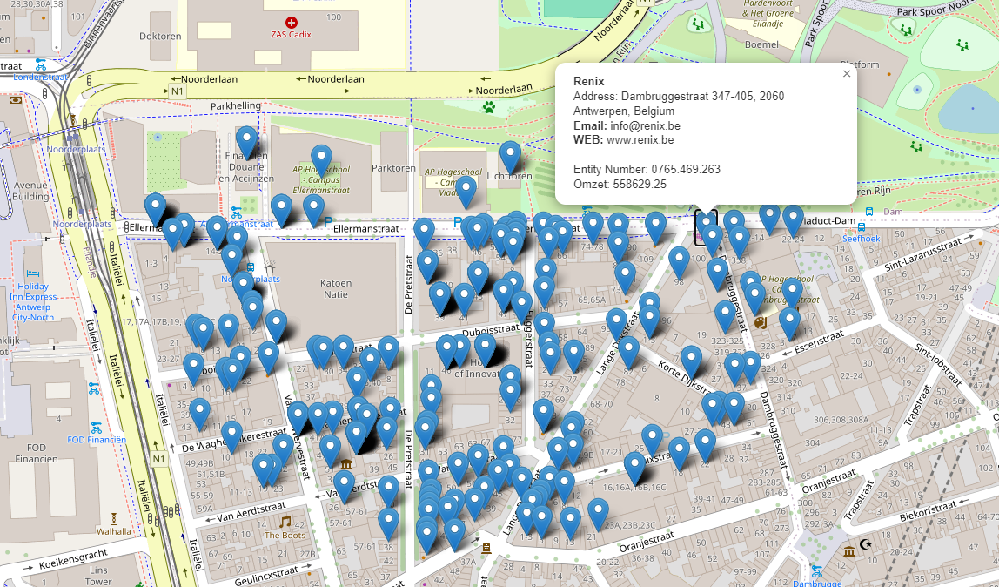

# KMO Map
Deze tool dient om data van Kruistpuntbank Ondernemingen (KBO) in kaart te brengen en om makkelijk inzicht te krijgen op een aantal bedrijven.



## Werking
De tool is aangedreven door OpenData gegevens van het KBO en publieke formulieren uit CBB. Deze tool zal door alle bedrijven gaan die geregistreerd staan in het KBO, vervolgens zullen de bedrijven gelinkt worden met hun financiële informatie via het CBB om zo de grootte van het bedrijf te bepalen. Dit wordt ten slotte getoond op een interactieve kaart waar je allerlei informatie terugvind over de bedrijven zoals contactinformatie, websites, en hun omzet in het laatste fiscaal jaar.

## Voorbereiding
Het project bestand momenteel KBO data voor postcodes 2000, 2140 en 2060. Als je de volledige data wil voor heel België kan je die [hier](https://economie.fgov.be/nl/themas/ondernemingen/kruispuntbank-van/diensten-voor-iedereen/hergebruik-van-publieke/kruispuntbank-van-0) downloaden.
**Als je een postcode wil toevoegen die niet in het project zit volg dan deze stappen**
1. Plaats de folder met csv-bestanden in de root van het project.
2. Voor het onderstaand commando uit voor je gekozen postcode:
   ```
    python main.py <postcode>
   ```
3. Vervolgens moeten de adressen uit de KBO data worden omgezet naar hun respectievelijke coördinaten. Dit kan enige tijd duren:
     ```
       python geocody.py <postcode>
     ```
4. Link KBO gerigistreerde bedrijven met hun CBB data:
      ```
      python omzet.py <postcode>
      ```
5. Zet daarna de data om naar json:
      ```
      python merge_to_json.py
      ```
6. Start ten slotte de server op:
      ```
      cd server
      python -m http.server 8000
      ```
      
      De KMO is nu beschikbaar op http://localhost:8000

**Als je aan de slag wil gaan met de bestaande data (postcode 2060), voer dan alleen stap 6 uit.**
